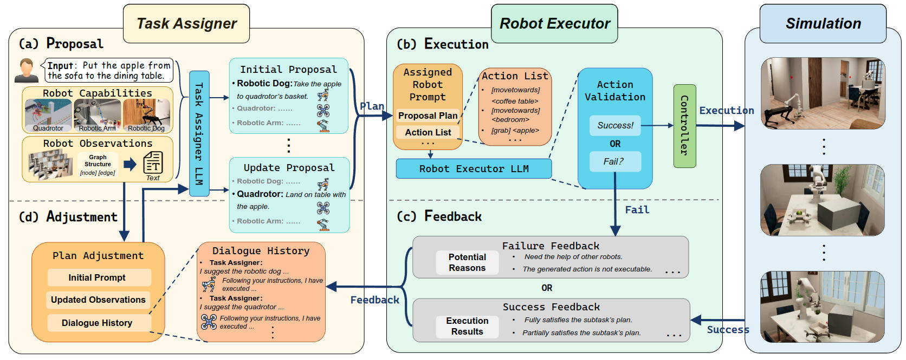
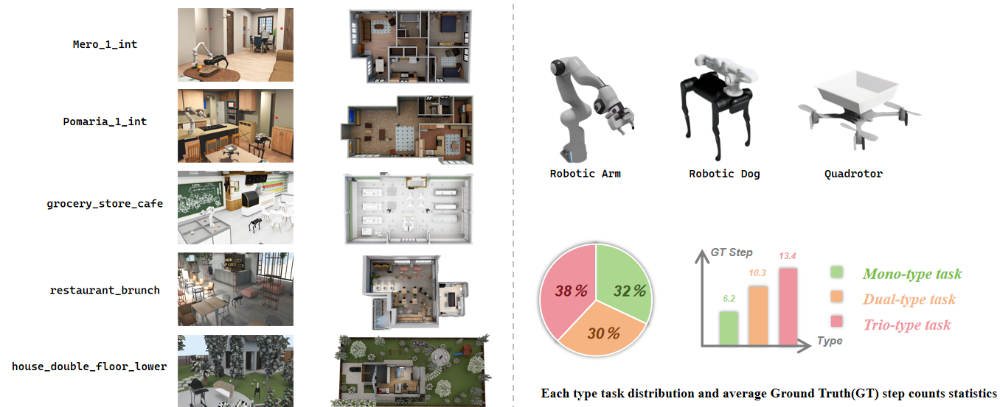

# COHERENT: Collaboration of Heterogeneous Multi-Robot System with Large Language Models

### [Paper](https://arxiv.org/abs/2409.15146) | [Video](https://youtu.be/dV1J-VXdEJA)

> COHERENT: Collaboration of Heterogeneous Multi-Robot System with Large Language Models <br />
> Author: Kehui Liu, Zixin Tang, Dong Wang, Zhigang Wang, Bin Zhao, Xuelong Li
>
<!-- <p align="center">
  <a href="">
    
  </a>
</p> -->
## Abstract

Leveraging the powerful reasoning capabilities of large language models (LLMs), recent LLM-based robot task planning methods yield promising results. However, they mainly focus on single or multiple homogeneous robots on simple tasks. Practically, complex long-horizon tasks always require collaborations among multiple heterogeneous robots especially with more complex action spaces, which makes these tasks more challenging. To this end, we propose COHERENT, a novel LLM-based task planning framework for collaboration of heterogeneous multi-robot systems including quadrotors, robotic dogs, and robotic arms. Specifically, a Proposal-Execution-Feedback-Adjustment (PEFA) mechanism is designed to decompose and assign actions for individual robots, where a centralized task assigner makes a task planning proposal to decompose the complex task into subtasks, and then assigns subtasks to robot executors. Each robot executor selects a feasible action to implement the assigned subtask and reports self-reflection feedback to the task assigner for plan adjustment. The PEFA loops until the task is completed. Moreover, we create a challenging heterogeneous multi-robot task planning benchmark encompassing 100 complex long-horizon tasks. The experimental results show that our work surpasses the previous methods by a large margin in terms of success rate and execution efficiency.

## Benchmark
 
we create a large-scale embodied benchmark tailored for heterogeneous multi-robot collaboration, including quadrotors, robotic dogs, and robotic arms. Built upon the [BEHAVIOR-1K](https://behavior.stanford.edu/behavior-1k), our benchmark covers 5 typical real-world scenes: 2 apartment scenes, 1 apartment with garden scene, 1 grocery store and 1 restaurant, with a wide range of interactive objects (both rigid and articulated) and various layouts (e.g., multi-room and multi-floor). The ground truth (GT) of each task represents the optimal number of steps for completion. Based on the minimum necessary number of robot types to perform each task, the benchmark is split into three categories: Mono-type Tasks, Dual-type Tasks and Trio-type Tasks.

## Install
Install the repo:
```bash
git clone https://github.com/MrKeee/COHERENT.git
```
Create a conda environment:
```bash
conda create -n coherent python==3.10
```
Install dependencies:
```bash
pip install -r requirments.txt
```
## Run
Add your openai api_key and organization in `args.py`.
For each methods in `src/experiment`， you can run the following command to perform the tasks in our benchmark:
```bash
python main.py --env env0 --task 2
```
For MCTS methods, you can run:
```bash
python mcts_agent.py --env env0 --task 2
```

**NOTE:**
- For the DRMS methods, the argument `--rounds` is the number of rounds of conversation and the default value is 1. For the MCTS methods,  the argument `--use_llm` indicates whether you are using an LLM and the default value is True.
- Please note that the type of LLM you use and the number of tasks you choose will directly determine your costs.

## Simulation Setup
Install NVIDIA's [Omniverse Isaac Sim](https://docs.omniverse.nvidia.com/app_isaacsim/app_isaacsim/install_workstation.html). **Please make sure you have the 2022.2.0 version of Isaac Sim installed.** We have added controllers for the quadrotor and the robotic arm on the back of the robotic dog, so we are providing the compressed package of the Isaac Sim used [here](https://drive.google.com/file/d/1wmqztsn8vwgHB_fL4LMamfuiDY7nXrlT/view?usp=drive_link).
The version of OmniGibson we are using is v0.2.1. Clone the [OmniGibson](https://github.com/StanfordVL/OmniGibson) repository:
```bash
git clone https://github.com/StanfordVL/OmniGibson.git
cd OmniGibson
git checkout aa8b8701e6abc3f2310a883a0ce2b635405347c7
```
Move the `assets/Benchmark` directory to `OmniGibson/` using this command:
```
cd ..
mv assets/Benchmark OmniGibson/
```
Download the heterogeneous robot asset files [here](https://drive.google.com/drive/folders/1CRX7mNndvNpty7dC37yHDOr25a0Xc-Ge?usp=drive_link) and move them to the `Benchmark` folder in `assets`.

Setup a virtual conda environment to run `OmniGibson` and Download `OmniGibson` dataset (within the conda env):
```bash
cd OmniGibson
./scripts/setup.sh 
python scripts/download_datasets.py
```
Run the following scripts:
```bash
cd Banchmark
sh run.sh
```


## Acknowledgement
We adapt codes from some awesome repositories, including [llm-mcts](https://github.com/1989Ryan/llm-mcts), [Co-LLM-Agents](https://github.com/1989Ryan/llm-mcts), [OmniGibson](https://github.com/StanfordVL/OmniGibson).

## Citation

If you use this work or find it helpful, please consider citing: (bibtex)
```
@article{liu2024coherent,
  title={COHERENT: Collaboration of Heterogeneous Multi-Robot System with Large Language Models},
  author={Liu, Kehui and Tang, Zixin and Wang, Dong and Wang, Zhigang and Zhao, Bin and Li, Xuelong},
  journal={arXiv preprint arXiv:2409.15146},
  year={2024}
}
```

This projet is set up on [**`OmniGibson`**](OmniGibson), which is built upon NVIDIA's [Omniverse](https://www.nvidia.com/en-us/omniverse/) platform. If you use this project, please cite:
```
@inproceedings{
li2022behavior,
title={{BEHAVIOR}-1K: A Benchmark for Embodied {AI} with 1,000 Everyday Activities and Realistic Simulation},
author={Chengshu Li and Ruohan Zhang and Josiah Wong and Cem Gokmen and Sanjana Srivastava and Roberto Mart{\'\i}n-Mart{\'\i}n and Chen Wang and Gabrael Levine and Michael Lingelbach and Jiankai Sun and Mona Anvari and Minjune Hwang and Manasi Sharma and Arman Aydin and Dhruva Bansal and Samuel Hunter and Kyu-Young Kim and Alan Lou and Caleb R Matthews and Ivan Villa-Renteria and Jerry Huayang Tang and Claire Tang and Fei Xia and Silvio Savarese and Hyowon Gweon and Karen Liu and Jiajun Wu and Li Fei-Fei},
booktitle={6th Annual Conference on Robot Learning},
year={2022},
url={https://openreview.net/forum?id=_8DoIe8G3t}
}
```
